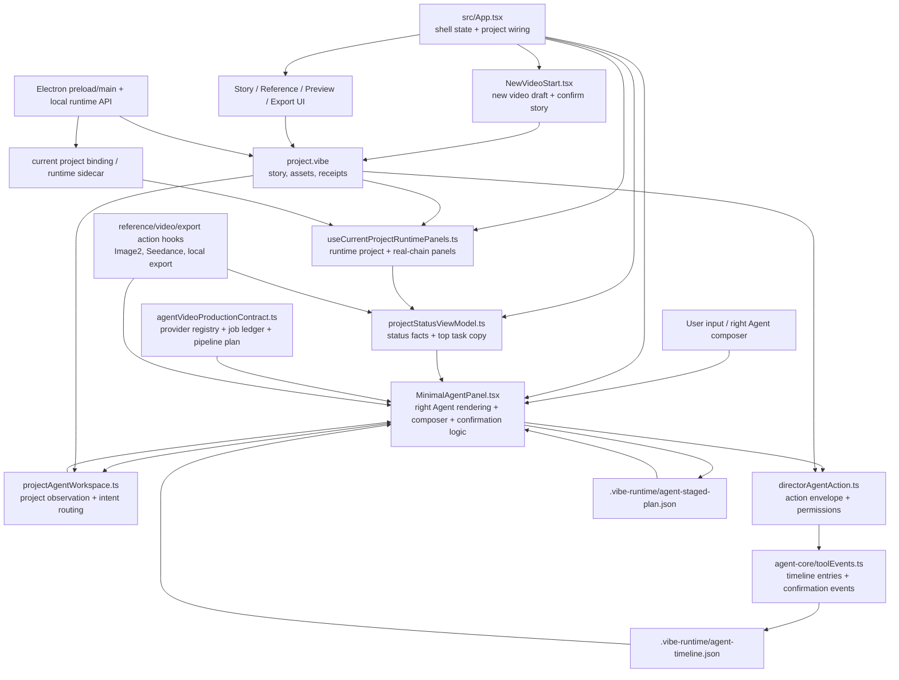

# Vibe Director Studio Agent-first Architecture Audit

审计日期：2026-07-07
工作目录：`/Users/lichenhao/Desktop/new vibe directing`

## 范围

本轮只做架构审计和重构规划，不做代码改造、不启动前端 dev server、不做 UI 视觉调整、不接真实视频 API、不清理无关 dirty 文件。

输入证据：

- `docs/thread-handoff-agent-ui-20260626.md`
- `docs/agent-first-headless-coverage-audit-20260702.md`
- `git status --short`
- `src/ui/director/MinimalAgentPanel.tsx`
- `src/ui/app/projectStatusViewModel.ts`
- `src/ui/app/useCurrentProjectRuntimePanels.ts`
- `src/core/projectAgentWorkspace.ts`
- `src/core/directorAgentAction.ts`
- `src/core/agentVideoProductionContract.ts`
- `src/project/projectAgentTimeline.ts`
- `src/project/projectAgentStagedPlanDraft.ts`
- `src/agent-core/toolEvents.ts`

## 一句话结论

现在最值得重构的不是视觉层，而是 Agent-first 主链路里的“当前主任务”判定。它目前分散在右侧 Agent 组件、项目状态 ViewModel、timeline 恢复、staged plan 恢复、动作 hook、runtime project binding 和新的视频 pipeline contract 里。继续直接改 UI 会让每个确认卡、恢复状态、发送视频边界都变成局部补丁。

推荐先做一个纯函数式的 `AgentCurrentTaskProjection`，把“现在到底应该让用户确认什么、等待什么、执行什么”收敛成唯一出口。UI 只消费这个结果。

## 当前模块责任图



## 状态源清单

| 状态源 | 主要职责 | 主要读写方 | 当前风险 |
| --- | --- | --- | --- |
| `project.vibe` | 项目事实：故事、镜头、素材、收据、导出信息 | Story/Reference/Preview/Export UI、project runtime、Agent action snapshot | browser draft、临时项目、本地项目迁移之间容易产生“故事已确认但 UI 显示空”的边界问题。 |
| `.vibe-runtime/agent-timeline.json` | Agent 历史、工具事件、确认卡事件 | `toolEvents.ts`、`projectAgentTimeline.ts`、`MinimalAgentPanel.tsx` | 旧 waiting confirmation 如果没有被当前事实/任务过滤，可能抢占右侧主任务。 |
| `.vibe-runtime/agent-staged-plan.json` | 等待确认的 staged action、handoff、权限、阻断原因 | `projectAgentStagedPlanDraft.ts`、`MinimalAgentPanel.tsx` | 已有 projectId/root/factHash/ttl/cleared 校验，但它还不是唯一的恢复规则来源。 |
| current project binding / runtime sidecar | 当前本地项目路径和 runtime 文档绑定 | Electron preload/main、runtime client、`useCurrentProjectRuntimePanels.ts` | browser draft 迁移到本地项目时，binding 和草案事实必须同向推进，否则会回到未连接或空项目状态。 |
| React session state | 当前页面、输入框、selected shot、临时草案、动作状态 | `App.tsx`、`MinimalAgentPanel.tsx`、各 action hook | 业务判断混在组件状态里，真实 packaged App 交互比 headless 更容易暴露 stale state。 |
| `ProjectStatusViewModel` | 顶部/右侧事实文案、阶段、等待对象、下一步 | `projectStatusViewModel.ts` | 它已经在按 timeline、new video、project ready、export、video、reference 做优先级判断，但不是确认卡的唯一仲裁者。 |
| `ProjectObservationProjection` | 项目当前任务：故事、参考、视频、confirmation kind | `projectAgentWorkspace.ts` | 它能表达“需要项目/补参考/素材复核/发视频”，但和 timeline/staged-plan/job-ledger 还未统一。 |
| `DirectorAgentActionEnvelope` | Agent 准备执行的动作、权限、目标、tool handoff | `directorAgentAction.ts`、`MinimalAgentPanel.tsx` | action envelope 能定义边界，但右侧 Agent 仍在组件内决定何时展示、恢复和确认。 |
| reference/video/export action hooks | 真实生成、提交、导出动作状态 | Image2/Seedance/export hooks、`projectStatusViewModel.ts` | action 状态会影响主任务，但和 staged plan/timeline/job ledger 是并列输入。 |
| `AgentVideoProductionContract` | provider capability、generation job ledger、pipeline plan、当前 pipeline task | `agentVideoProductionContract.ts` | 这是正确方向，但目前仍偏 contract/test 层，尚未成为 packaged App 的主任务投影入口。 |

## 主链路数据流

### 1. 新视频

入口主要来自右侧 Agent 输入和 `NewVideoStart.tsx`。用户描述故事后，系统先形成新视频草案，而不是直接写入本地项目、生成参考或提交视频。右侧应进入“确认这版故事”边界。

关键风险：草案状态、`project.vibe`、runtime binding、timeline confirmation 必须指向同一版故事。任何 restore 或空项目投影抢先，都会出现“确认卡还在，但中间 0 镜头”的问题。

### 2. 确认故事

确认后，故事事实应进入项目草案或本地项目状态。此时右侧主任务应该切到“选择保存位置”或后续本地项目动作，而不是残留“确认这版故事”。

关键风险：确认动作现在跨 `NewVideoStart` 回调、右侧 confirmation button、project status projection、runtime restore。需要唯一的确认提交结果作为事实源。

### 3. 选择保存位置

这是从 browser draft 迁移到本地 project root 的边界。它只应该选择或创建保存位置，并建立 binding。它不应该生成参考、不应该提交视频、不应该导出。

关键风险：保存位置是基础设施动作，但它会改变 `folderReady/projectReady/projectRoot`，因此容易影响 `ProjectStatusViewModel` 和 timeline restore 的主任务优先级。

### 4. 补参考

用户说“开始补参考”后，应进入参考确认流程。`projectAgentWorkspace.ts` 已经能把正向参考意图路由为 `reference_generation`，`directorAgentAction.ts` 能产生 `prepare_reference_generation` envelope。

关键风险：补参考的“计划说明”和“真实生成”必须被 confirmation boundary 隔开。缺参考时，发送视频也应该转入补参考确认，而不是直接提交视频。

### 5. 发送视频

用户说“发送视频”后，系统应先检查故事和参考。参考缺失时进入补参考确认；参考满足时进入视频提交确认。它不能被 selected shot 编辑确认抢走，也不能绕过确认直接提交。

关键风险：视频意图判断分散在 `projectAgentWorkspace.ts`、`directorAgentAction.ts`、`MinimalAgentPanel.tsx`、video action hook 和 status view model。P0 投影需要明确“视频请求但缺参考”的唯一结果。

### 6. 导出

导出必须先出现确认。用户说“继续 / 没问题 / 确认”只能确认当前导出边界，不能跳过边界直接写交付包。确认后才允许本地 export action 写入文件。

关键风险：导出既能从 export view readiness 触发，也能从右侧 Agent route 触发，还能受历史 timeline/staged-plan 恢复影响。需要把 active export confirmation 绑定到当前 project facts。

## 架构问题清单

### P0 问题：当前主任务没有单一投影

现在“右侧 Agent 当前应该做什么”至少由这些地方共同决定：

- `projectStatusViewModel.ts`：根据 timeline、新视频、project ready、export、video、reference 计算阶段和下一步。
- `projectAgentWorkspace.ts`：根据项目观察生成 `currentTask.confirmation.kind`。
- `MinimalAgentPanel.tsx`：选择可见 confirmation、过滤 stale confirmation、处理 footer action、处理 selected context、处理 staged plan 恢复。
- `projectAgentStagedPlanDraft.ts`：恢复 active/cleared/expired/mismatch staged plan。
- `projectAgentTimeline.ts` 和 `toolEvents.ts`：恢复 timeline 中的 waiting confirmation。
- `agentVideoProductionContract.ts`：已经有 pipeline plan、job ledger、current task contract，但还没有成为 UI 主入口。

这会导致每修一个真实 App 阻断，都容易补在最靠近 UI 的地方。短期能过测试，长期会让 packaged App 恢复、确认卡、主任务文案继续互相抢优先级。

### P1 问题：`MinimalAgentPanel.tsx` 承担过多业务逻辑

右侧 Agent 现在不只是渲染消息，它还在做：

- confirmation stale 判断和可见消息选择。
- composer intent routing 和 preview。
- selected shot 上下文和主链路意图的冲突处理。
- staged plan restore 到 UI message。
- action envelope 到按钮状态的映射。
- 新视频确认卡、保存位置确认、项目编辑确认、tool confirmation 的多类特殊分支。

这个组件应该最终变成 renderer + event dispatcher。业务判断应下沉到 core projection 和 core action modules。

### P2 问题：timeline / staged-plan / job-ledger 还不是同一个恢复模型

`projectAgentStagedPlanDraft.ts` 已经有很好的恢复门槛：`cleared`、ttl、projectId、projectRoot、factHash、action context。`agentVideoProductionContract.ts` 也有 job ledger 和 pipeline current task。但是右侧主任务仍需要在多个恢复来源之间临场仲裁。

建议把恢复规则固化为一个纯函数，并让 UI 不再自己比较旧卡和新状态。

### P3 问题：provider dry-run contract 尚未接入真实主链路

新的视频 contract 已经把 provider capability、job ledger、pipeline plan 拆出来了。下一步不应该直接接真实 MiniMax/Seedance，而是先接一个 dry-run adapter，让确认、ledger、pipeline、timeline 都在 packaged App 里跑通。

这样可以在不消耗真实额度、不引入外部失败变量的情况下，验证“确认边界”和“任务恢复”。

### P4 问题：UI 重做前缺少证据包输入

Product Design/ImageGen UI 重做可以做，但应该等 P0-P3 后再做。否则新 UI 会复制旧逻辑：每个视觉卡片都偷偷承担一点业务仲裁。

UI 重做前应该准备：

- packaged App 主链路录屏或截图证据。
- 当前主任务 projection 的 JSON 样例。
- 每个主链路状态的确认卡和 facts。
- provider dry-run 的 job ledger 样例。

## 推荐重构顺序

### P0：建立 `AgentCurrentTaskProjection`

目标：新增一个纯函数，统一输出右侧 Agent 当前主任务。

建议接口：

```ts
type AgentCurrentTaskSource =
  | "new_video_draft"
  | "project_setup"
  | "timeline_confirmation"
  | "staged_plan"
  | "pipeline_job"
  | "pipeline_plan"
  | "project_status";

interface AgentCurrentTaskProjection {
  source: AgentCurrentTaskSource;
  step:
    | "draft_story"
    | "confirm_story"
    | "choose_save_location"
    | "prepare_references"
    | "submit_video"
    | "export"
    | "idle";
  label: string;
  requiresConfirmation: boolean;
  confirmationId?: string;
  actionId?: string;
  blockers: string[];
  facts: Array<{ label: string; value: string }>;
}
```

输入应该来自当前已有模块，不在第一步迁移全部状态：

- `ProjectStatusViewModel`
- `ProjectObservationProjection`
- latest valid timeline waiting confirmation
- restored staged plan
- `AgentVideoPipelinePlan`
- `AgentVideoGenerationJobLedger`
- new video draft status
- reference/video/export action state
- local project binding state

验收标准：

- “确认这版故事”确认后，不可能同时输出 `confirm_story` 和 `0 镜头/无草案`。
- 缺参考时，“发送视频”唯一输出 `prepare_references`，不是 `submit_video`。
- “开始补参考”唯一输出 reference confirmation，不跳到 video/export。
- “选择保存位置”不触发 reference/video/export。
- 导出必须先输出 export confirmation，确认后才进入 export job。
- stale timeline confirmation 和 cleared staged plan 不能抢当前主任务。

测试建议：

- 新增或扩展一个 contract test，直接断言 projection 输出。
- 先不改 UI，只让测试覆盖当前 headless 主链路。
- 之后再把 `MinimalAgentPanel.tsx` 的主任务选择替换为这个 projection。

### P1：把 `MinimalAgentPanel.tsx` 的业务逻辑下沉

目标：让右侧 Agent 只负责展示、点击、输入派发。

拆分顺序：

1. confirmation 可见性和 stale 判断下沉到 `core/agentCurrentTaskProjection` 或相邻模块。
2. composer intent preview 下沉到 `projectAgentWorkspace.ts` 或新 `agentComposerRoute.ts`。
3. confirmation button enable/disable 原因下沉到纯函数。
4. selected shot 上下文只作为 projection input，不在组件内覆盖主链路。

验收标准：

- `MinimalAgentPanel.tsx` 可以继续很大，但不再新增业务分支。
- 新增主链路判断时，只改 core projection test，不改 JSX 条件森林。
- `minimal-agent-p1`、`minimal-ui`、`current-project-ui-closed-loop` 继续通过。

### P2：统一 timeline / staged-plan / job-ledger 恢复规则

目标：把“恢复后谁能成为当前主任务”变成固定规则。

建议规则：

1. projectId、projectRoot、factHash 不匹配的一律不可恢复为当前任务。
2. `cleared` staged plan 永远压过旧 active plan。
3. terminal job 不可成为当前任务。
4. waiting confirmation 只有在匹配当前 pipeline step 时才可成为当前任务。
5. timeline 只提供证据和历史，不直接决定当前主任务。
6. 新事实产生后，旧确认卡必须降级为历史消息。

验收标准：

- 关闭重开 packaged App 后，右侧主任务、确认卡、timeline 文案一致。
- 旧确认卡、被动项目状态、执行结果不能抢当前主任务。
- restore 相关 contract test 明确覆盖 active、cleared、expired、fact mismatch、project root mismatch。

### P3：接入 provider dry-run adapter

目标：不接真实外部 API，先让 provider capability、job ledger、pipeline plan 在 packaged App 主链路里闭环。

建议做法：

- `prepare_references` 确认后写入 dry-run reference job。
- `submit_video` 确认后写入 dry-run video job。
- `export` 确认后写入 local export job。
- job 状态变化写入 timeline/tool result。
- provider registry 只报告能力和限制，不做真实提交。

验收标准：

- packaged App 能跑通：补参考确认 -> 发送视频确认 -> 确认故事 -> 选择保存位置 -> 导出确认 -> 执行导出。
- 没有真实 API key、没有网络 provider，也能看到完整 job ledger 和 timeline。
- 所有动作仍保留确认边界。

### P4：UI 重做前证据包

目标：给 Product Design/ImageGen UI 重做提供稳定输入，而不是让设计阶段反推业务逻辑。

证据包应包含：

- 主链路每一步的 `AgentCurrentTaskProjection` JSON。
- 每一步的右侧 Agent 消息、确认卡、facts。
- packaged App 主链路验证记录。
- provider dry-run job ledger 样例。
- 不能改动的业务边界清单。

UI 重做原则：

- UI 可以重新布局，但不能重新发明主任务优先级。
- 确认卡、任务状态、timeline 必须从 projection 读取。
- 视觉组件不直接判断“现在该补参考还是发视频”。

## 不推荐的做法

- 不建议先按视觉区域大拆组件。这样只会把业务条件复制到更多小组件里。
- 不建议马上接真实 MiniMax/Seedance。真实 provider 会把架构问题和外部失败混在一起。
- 不建议在 UI 重做前改颜色、密度、卡片、字体。当前风险不是视觉，而是状态来源竞争。
- 不建议做大规模重写。这个项目已经有很多 contract tests，应该沿着纯函数投影逐步收口。
- 不建议清理 dirty tree 作为本次架构工作的一部分。当前仓库已有大量进行中改动，架构审计应保持最小新增面。

## 下一步执行提示词

```text
你在 /Users/lichenhao/Desktop/new vibe directing 工作。

不要读取旧 Codex 线程全文。先读：
1. docs/thread-handoff-agent-ui-20260626.md
2. docs/agent-first-headless-coverage-audit-20260702.md
3. docs/agent-first-architecture-audit-20260707.md
然后检查 git status --short。

目标：只做 P0 架构收口，建立 Agent-first 当前主任务的单一 projection contract。

本轮不要做 UI 重做，不进入 Product Design / ImageGen，不启动前端 dev server，不改颜色、布局、字体、卡片样式，不接真实视频 API，不做泛化重构，不清理无关 dirty 文件，不 git add / commit / revert。

范围：
1. 新增或扩展一个纯函数 projection，用来输出右侧 Agent 当前主任务。
   - 输入可以先复用现有 ProjectStatusViewModel、ProjectObservationProjection、timeline waiting confirmation、staged plan、AgentVideoPipelinePlan、job ledger、新视频草案状态、本地项目 binding、reference/video/export action state。
   - 输出必须包含 step、source、label、requiresConfirmation、confirmationId/actionId、blockers、facts。

2. 先用 contract tests 锁定行为，不急着替换 UI。
   必须覆盖：
   - 新视频草案待确认时，当前任务是 confirm_story。
   - 确认故事后，故事 2 镜头保留，当前任务进入 choose_save_location。
   - 缺参考时，发送视频请求必须输出 prepare_references，不能输出 submit_video。
   - 开始补参考必须输出 reference confirmation，不能跳到 video/export。
   - 选择保存位置只输出 project setup，不生成参考、不提交视频、不导出。
   - 导出必须先输出 export confirmation。
   - stale timeline confirmation、cleared staged plan、terminal job 不能抢当前主任务。

3. 如果需要接入 UI，只做最小读取，不改视觉。
   - 优先让 MinimalAgentPanel 消费 projection 的结果。
   - 不移动 JSX，不改样式，不做大拆分。

验证必须跑：
npm run new-video-start-contract:test
npm run current-project-ui-closed-loop:test
npm run minimal-agent-p1:test
npm run minimal-ui:test
npx tsc --noEmit --pretty false
git diff --check

成功标准：
P0 projection contract 能用测试证明“右侧 Agent 当前主任务”只有一个来源出口，并覆盖确认故事、保存位置、补参考、发送视频、导出、恢复 stale 状态这些边界。

最终交付：
- 修改了哪些最小文件
- projection 的输入/输出说明
- 每个主链路边界的测试结果
- 是否可以进入 P1：MinimalAgentPanel 业务逻辑下沉
```

## 总结

最优路线是先把“当前主任务”从 UI 组件里抽成可测试 contract，再逐步把右侧 Agent 的业务判断下沉。这样后续无论是 packaged App 验证、MiniMax/Seedance dry-run、还是 Product Design/ImageGen UI 重做，都不会继续在视觉层里修业务状态竞争。
