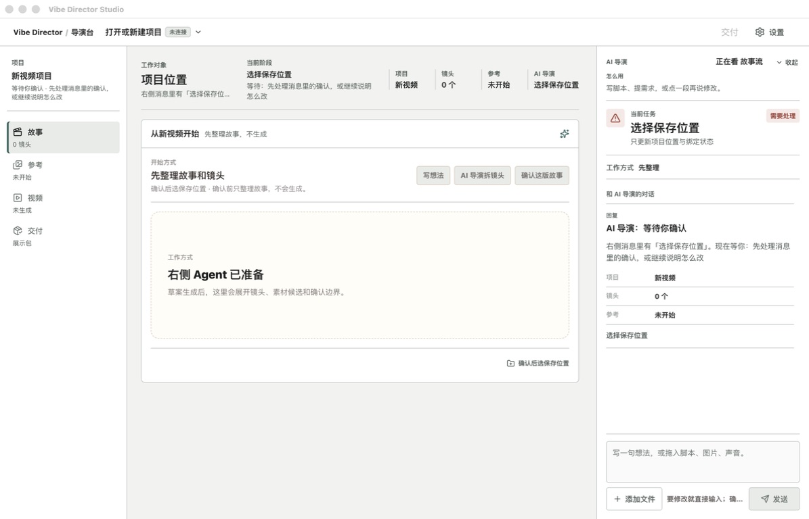
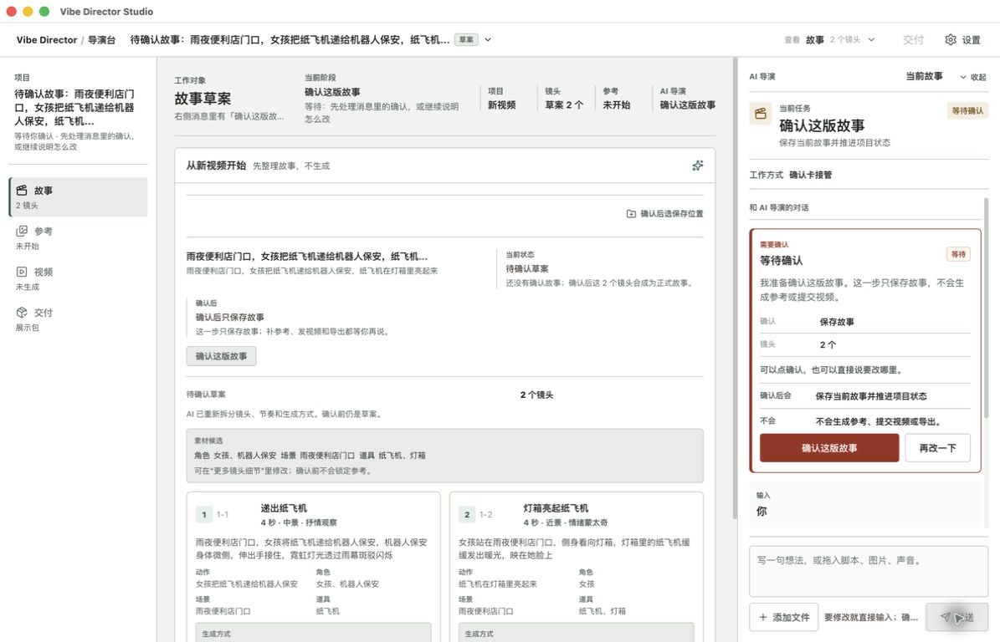
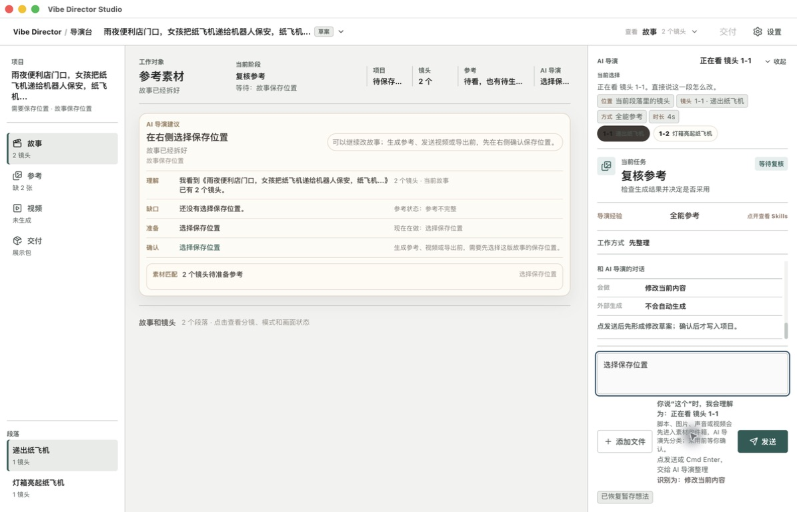
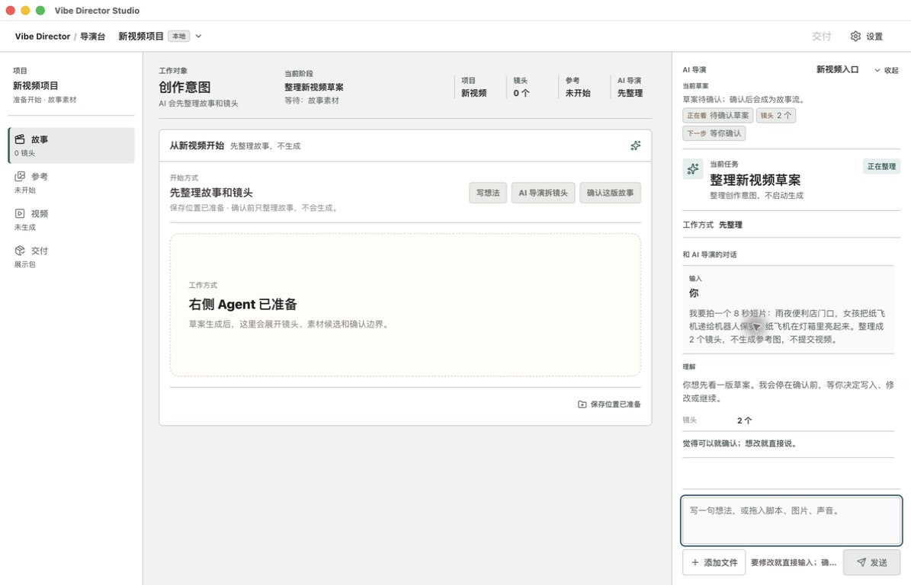
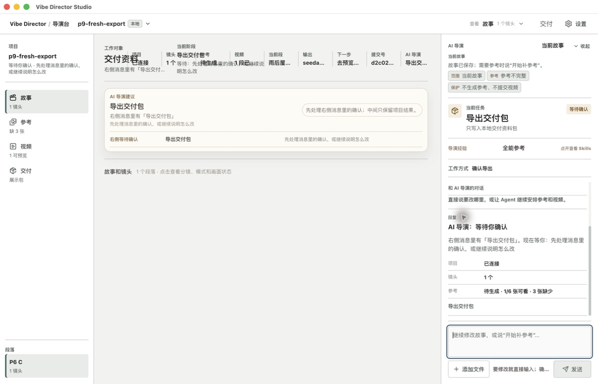
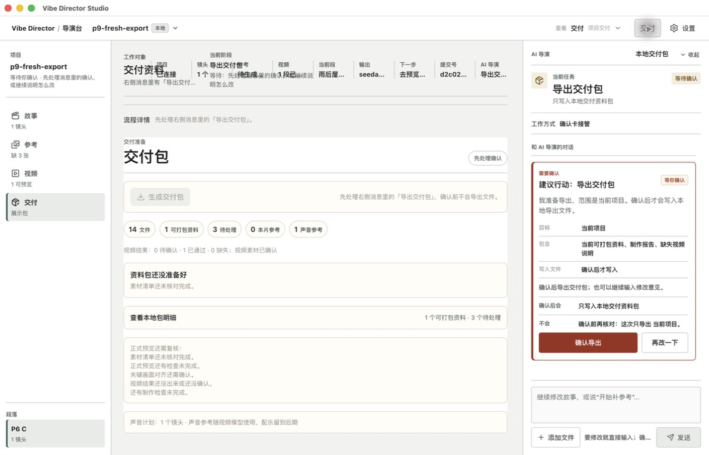
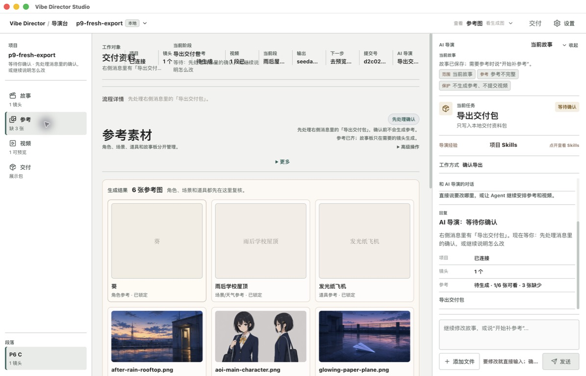
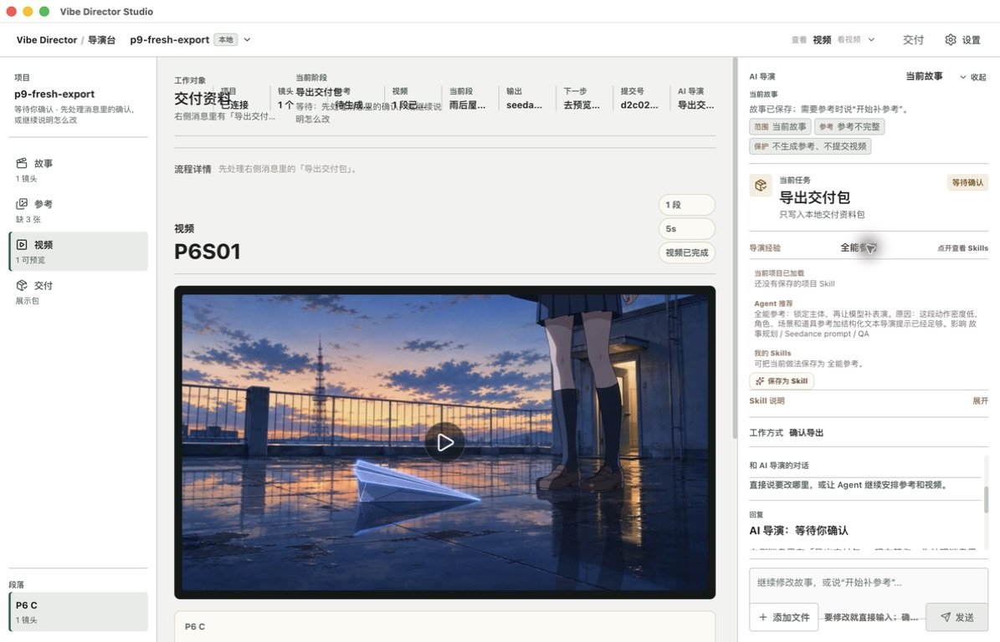
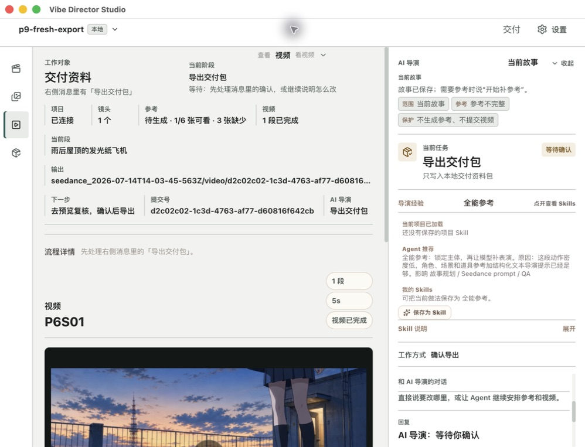

# Vibe Director Studio P10-A packaged UX audit

Date: 2026-07-16

Status: **BLOCKED**. P10-A captured real packaged evidence, but two P0 state defects prevent a complete main-flow inventory. P10-B should not start until they are fixed and the packaged path is rerun.

## Scope and controls

- App: `/Users/lichenhao/Desktop/new vibe directing/release/mac-arm64/Vibe Director Studio.app`
- Fresh root: `/tmp/vibe-director-p10-a-ux.R7YF5o`
- Terminal evidence project: `/tmp/vibe-director-p9-rc-20260716-BgDWNG/projects/p9-fresh-export`
- Capture: Computer Use against the packaged App, including a 998 x 763 constrained window
- No frontend dev server, UI edit, ImageGen, provider call, retry, approval, promotion, export execution, commit, or push
- Provider calls: `0`

Machine-readable inventory: `docs/evidence/p10-a-packaged-ux-20260716/state-inventory.json`.

## Executive verdict

The user's assessment is correct: the frontend is too complex. The main cause is not visual styling. It is that the product presents the same task through three narrators at once:

1. the left project rail;
2. the center work-state header and recommendation block;
3. the right Agent task, confirmation, Skill, conversation, and composer stack.

That repetition becomes dangerous when the narrators disagree. In this run the UI showed `复核参考`, `选择保存位置`, and later `导出交付包` as the current task for states whose durable project evidence said something else.

P10-B should therefore simplify around one rule: **one projection, one visible current task, one attached primary action; the center is the artifact workspace, not another Agent narrator.**

## Captured flow

| Step | Packaged result | Health | Evidence |
| --- | --- | --- | --- |
| 1. Fresh start | Opened with fresh profile | At risk | `01-fresh-start.png` |
| 2. Type story | Typing alone changes the whole page to an active planning state | At risk | `02-composer-filled.png` |
| 3. Draft ready | Two-shot draft and confirmation card appear | At risk | `03-draft-confirmation.png` |
| 4. Confirm unsaved story | Center asks for save location; right task says reference review | Broken | `04-story-confirmed-save-location.png` |
| 5. Ask for save location | Exact phrase is routed as a content edit and selects shot 1-1 | Broken | `05-save-location-intent-misrouted.png` |
| 6. Use folder picker | Remembered unrelated parent can replace the draft with an empty project | Broken | `06-save-location-state-loss.png` |
| 7. Confirm with a preselected root | Timeline says confirmed, `project.vibe` stays at zero shots, card vanishes | Broken | `07-confirmation-vanished-state-split.png` |
| 8. Cold restart | Empty project restores; no old story returns | Broken | `08-cold-restart-empty-after-confirm.png` |
| 9. Open terminal P9 project | Succeeded export restores as a waiting export confirmation | Broken | `09-terminal-export-restores-stale-confirmation.png` |
| 10. Delivery page | Existing 16-output package is presented as not ready and asks to export again | Broken | `10-delivery-page-stale-confirmation.png` |
| 11. Reference page | Real assets render, but five different reference-status claims conflict | Broken | `11-reference-state-contradictions.png` |
| 12. Video page | Real five-second preview renders; stale export task remains | At risk | `12-video-preview-with-stale-task.png` |
| 13. Expand Skills | Skill recommendation and save action crowd the current-task rail | At risk | `13-skills-expanded-density.png` |
| 14. Constrained width | Rail collapses, but content truncates and collapsed navigation loses AX names | Broken | `14-constrained-width-skills-and-task.png` |

### Step 1: fresh start

The screen has about 112 AX lines, 14 buttons, and 6 disabled controls before a story exists. `选择保存位置` appears eight times across status surfaces. The user has not yet expressed a creative intent, but saving already competes with the actual first action.

### Step 3: draft confirmation

The one real decision is valid: save this two-shot story or keep editing. It is surrounded by 172 AX lines, 18 buttons, two shot cards, candidate assets, method details, center confirmation copy, and a second confirmation treatment in the Agent rail. `确认这版故事` appears nine times in the AX surface.

### Steps 4-7: save and confirmation split

The UI says to choose a save location in the right rail, but the right rail has no such control. The actual folder action is hidden under the top project menu. Typing the exact visible task text is interpreted as an edit to the selected shot.

With a dedicated local root already connected, confirming the two-shot draft appends `draft_confirmed` timeline entries but leaves the durable project at `0` shots. The confirmation card disappears, so the user receives neither success nor a recoverable error.

### Steps 9-10: terminal export revived as pending

The P9 project has a `succeeded` live export job and 16 outputs, but the packaged App restores `导出交付包` as a waiting confirmation.

The delivery page then says `14 文件`, `资料包还没准备好`, and shows `确认导出`. This is a false authority boundary: repeating the action looks required even though the receipt-bound package already exists.

### Steps 11-14: dense workspaces

The reference page reaches 244 AX lines, 24 buttons, and 50 containers. On one screen it says `缺 3 张`, `1/6 张可看`, `6 张参考图`, `参考已齐`, and `已锁定`. These may describe different object layers internally, but the UI does not explain the distinction.

Expanding Skills adds recommendation reasoning, impacted consumers, a save action, and help content between the current task and conversation. Skill learning is useful, but it is secondary evidence, not part of the always-visible current-task stack.

At 998 x 763 the left rail becomes icon-only while the right rail stays permanently open. Long output paths, task facts, and recommendation text truncate. The four collapsed project navigation controls have no accessible names in the AX tree.

## Findings by severity

### P0. Confirmed story is not persisted when a local root was selected first

Reproduction:

1. Open `/tmp/vibe-director-p10-a-ux.R7YF5o/projects/p10-a-main-flow`.
2. Send the two-shot rain-night story through the right Agent.
3. Wait for `确认这版故事` and confirm it.
4. Observe timeline phase `draft_confirmed` with `2` shots.
5. Read `project.vibe`: fact hash `pv_a72c3648`, shot count `0`.
6. Restart: the empty project restores.

Root cause is narrow and non-visual. `startNewVideoFromAgent` always sets `projectTargetMode: "new_project"` in `src/ui/director/DirectorModeShell.tsx:1047`. `projectDraftTargetForNewVideoConfirmation` treats that mode as browser-only storage even when `projectFileSelection` already points at a local root in `src/App.tsx:5765`. The local timeline and browser draft then diverge.

Coverage gap: all five focused contract suites passed while this packaged path failed. Existing tests assert source structure, but do not execute `preselected local root -> Agent new story -> confirm -> project.vibe contains shots -> cold restart`.

### P0. Cleared/terminal export evidence is discarded before projection arbitration

The terminal fixture contains:

- current fact hash `pv_17dd191f`;
- job `agent_video_job_minimal_agent_current_task_export_001` with `status=succeeded`;
- live action `agent_action_2026_07_15t17_06_13_383z_prepare_export`;
- 16 output assets;
- cleared staged plan at `2026-07-15T17:23:13.359Z`.

It also retains an older waiting confirmation bound to fact hash `pv_cc4049f3`. On restore, `src/App.tsx:3287` computes the cleared result, but `src/App.tsx:3296` stores only an `ok` draft and turns the cleared marker into `undefined`. `MinimalAgentPanel` therefore receives no cleared-plan evidence at `src/ui/director/MinimalAgentPanel.tsx:8983`; the stale timeline confirmation can win over the terminal completion.

The expected projection is `step=idle`, `requiresConfirmation=false`, with live export completion. The visible projection is effectively `source=timeline_confirmation`, `step=export`, `requiresConfirmation=true`.

### P1. There are three competing current-task surfaces

The left rail, center header/recommendation, and right Agent all restate project, stage, blocker, next action, and status. They duplicate information when healthy and contradict one another when state is stale. P10-B should designate the right Agent projection as the only current-task narrator.

### P1. The visible task is detached from its action

`在右侧选择保存位置` has no right-rail control. `导出交付包` can be visible in the story view while the confirmation button is only discoverable after entering the delivery page. Every task should expose one adjacent primary action or a specific blocker, never an instruction to hunt elsewhere.

### P1. Status vocabulary mixes object layers

The reference surface mixes item count, preview count, required-slot count, lock authority, and generation completeness under the same word `参考`. Delivery mixes `交付`, `展示包`, `交付资料`, `交付包`, and `导出交付包`. P10-B needs a small controlled vocabulary with separate fields for availability, review, authority, and completion.

### P1. Typing is presented as execution before send

Entering text changes the main workspace and current task to `正在整理` before the user submits. Draft interpretation can appear near the composer, but the project should not look as though work started until the send command is accepted.

### P2. Skills compete with execution authority

Skill recommendation and save controls are useful evidence, but they should live behind a details/history affordance or a dedicated inspector. They should not sit between current task and conversation during confirmation or review.

### P2. Narrow width preserves too many simultaneous panes

Collapsing the left rail is not enough. At constrained width the product still preserves a dense main inspector and a full Agent rail. P10-B should define an explicit two-mode responsive rule: artifact-first with Agent drawer, or Agent-first with artifact detail, rather than compressing both.

## Recommended P10-B information architecture

This is a design constraint, not a visual direction:

1. Keep one global project switcher and one compact project structure rail.
2. Use the center only for the selected artifact: story, references, video, or delivery.
3. Put one current-task block at the top of the Agent rail, directly bound to `AgentCurrentTaskProjection`.
4. Attach exactly one primary action to that block; show blockers there.
5. Move project facts, receipts, Skills, and history into progressive disclosure below the task.
6. Let the conversation composer remain stable while typing; show intent interpretation locally.
7. On narrow windows, turn the Agent rail into a drawer or tab and keep navigation icon labels accessible.

## Accessibility risks and limits

Visible/AX risks:

- collapsed project navigation exposes unnamed buttons;
- disabled controls are numerous before the first action and often carry the only explanation in help text;
- long paths and identifiers truncate without a visible full-value affordance;
- state is communicated through small low-contrast secondary text and repeated labels;
- focus order is likely long because reference view exposes more than 240 AX lines.

Not verified in this run:

- full keyboard-only completion;
- VoiceOver reading order and announcements;
- contrast ratios and dynamic type;
- valid `needs_review`, failure, cancellation, and retry screens;
- fresh-chain reference/video/export execution, because story persistence failed first.

Screenshots alone do not establish accessibility compliance.

## Verification

Passed without provider calls:

- `npm run new-video-start-contract:test`
- `npm run agent-current-task-projection:test`
- `npm run current-project-ui-closed-loop:test`
- `npm run minimal-agent-p1:test`
- `npm run minimal-ui:test`
- `npx tsc --noEmit --pretty false`
- `git diff --check`

The passing contract suites do not override the packaged failures. They identify two missing behavioral tests.

## Gate decision

P10-A is **BLOCKED**, not passed. P10-B Product Design/ImageGen should wait for one focused non-visual repair round:

1. preserve a preselected local root when an Agent-started new story is confirmed;
2. retain the cleared-plan marker through restore and make terminal current-fact export completion suppress older confirmations;
3. add packaged/headless regressions for both paths;
4. rebuild the App and rerun the P10-A state inventory from the fresh story through terminal completion.

After that, the evidence already captured here is suitable input for simplifying the frontend. No color, typography, layout, or component implementation should begin before the state truth is stable.
