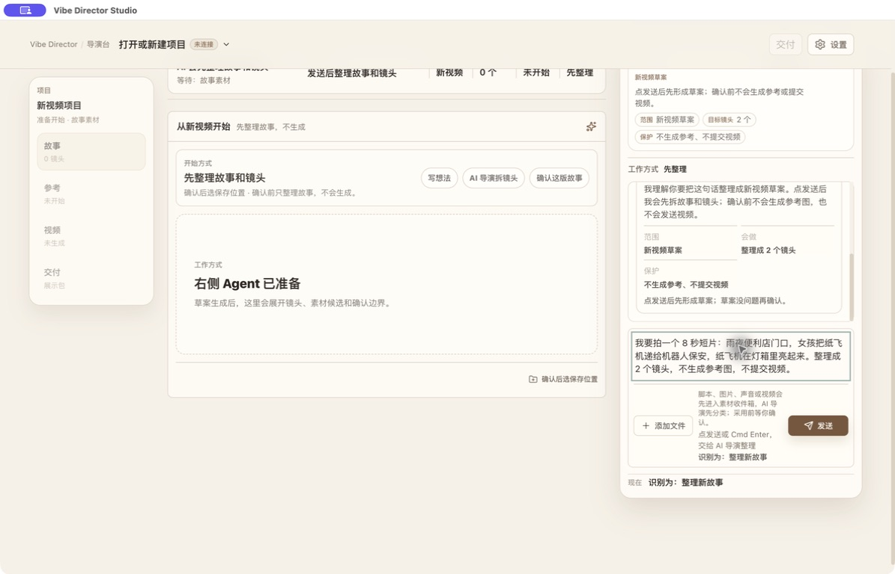
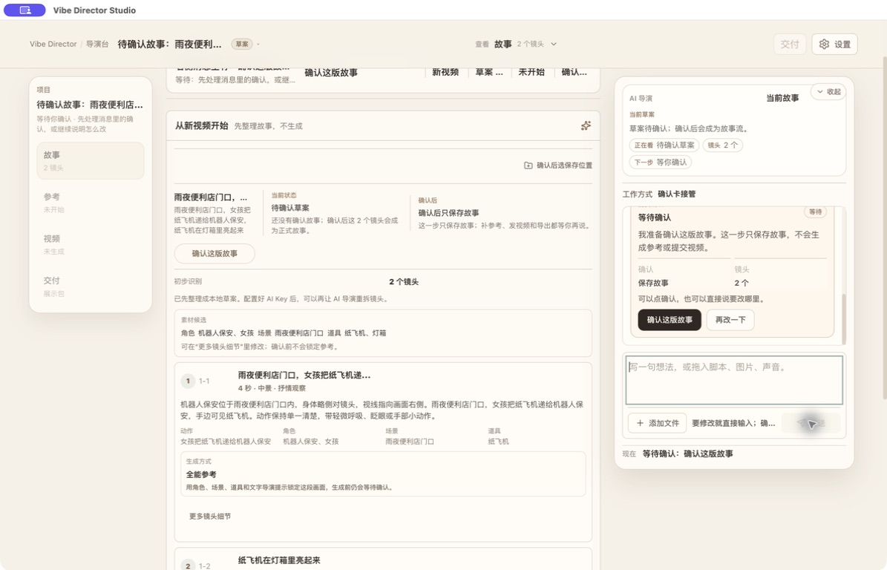
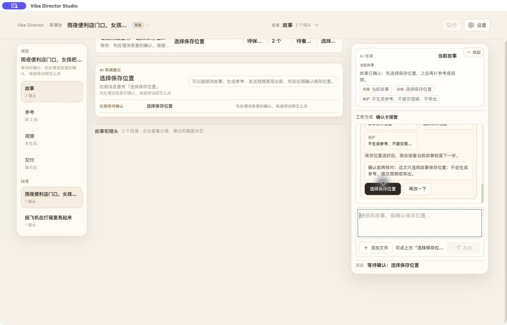
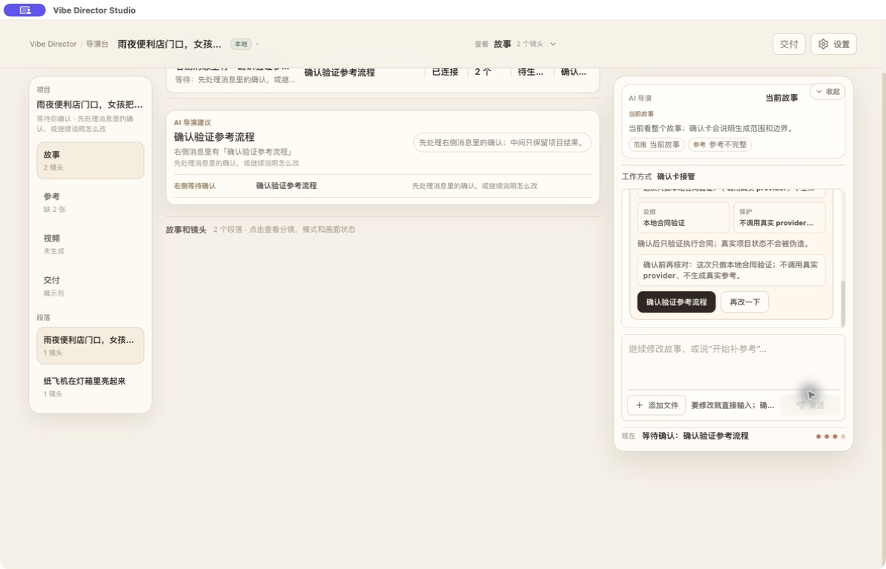
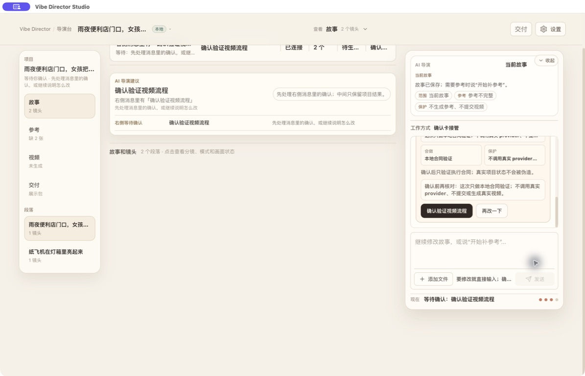
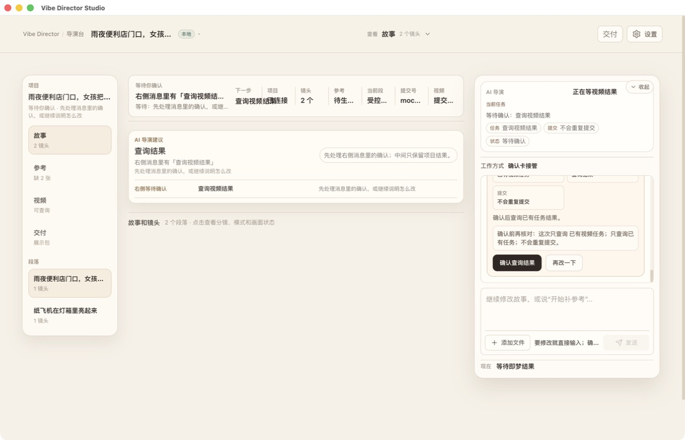
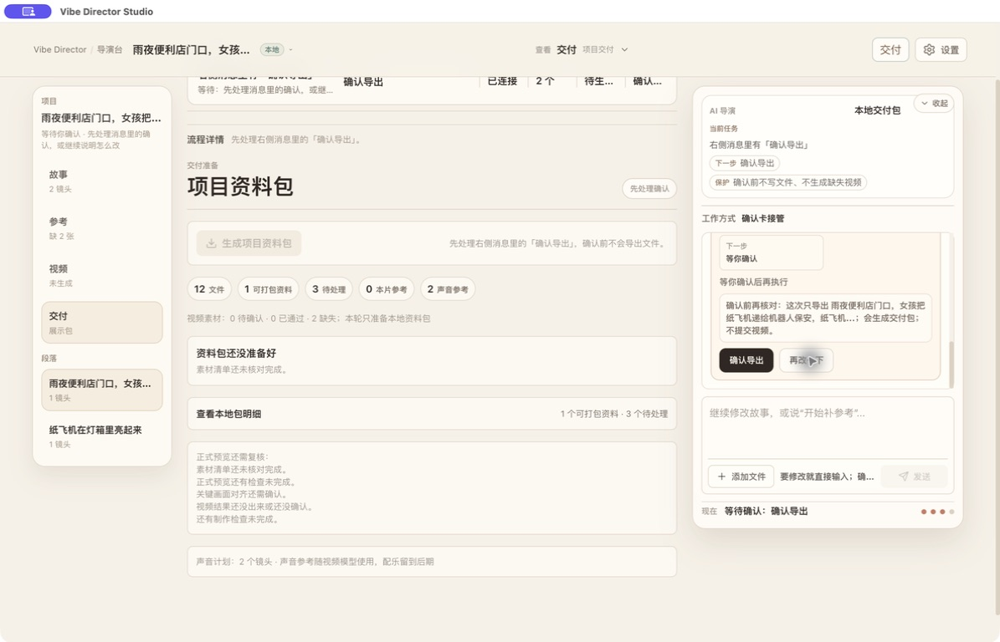
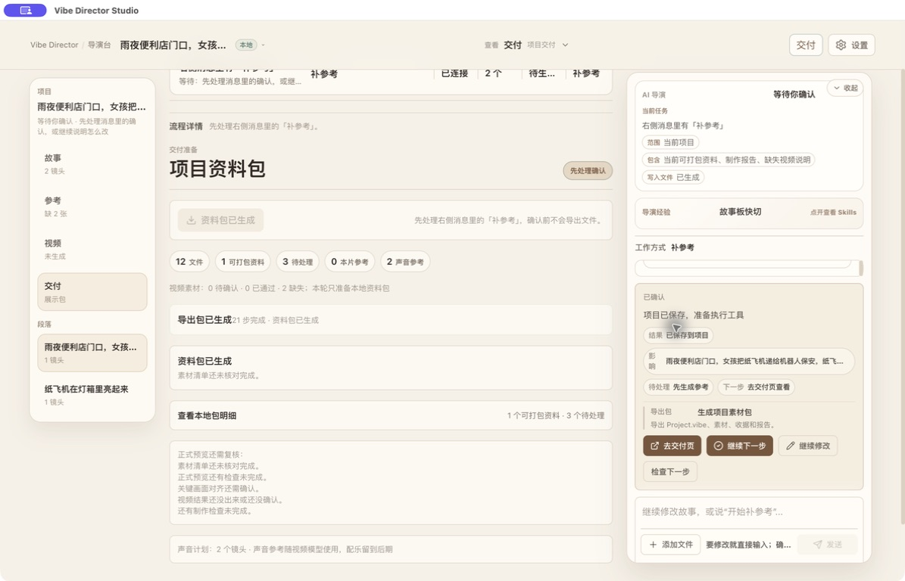

# Product Design Audit

## Scope

This audit covers the Agent-first packaged App path at 1195 x 768:

`new-video input -> draft confirmation -> save location -> reference confirmation -> video confirmation -> query result -> export confirmation -> execution complete/history`

The primary user is a creator who needs to understand the current production step, inspect the story and media, and confirm one bounded action without accidentally starting another action. The target for P5-B is WCAG 2.2 AA for normal desktop operation, keyboard access, focus visibility, contrast, and reflow at supported widths.

## Executive Judgment

The product already has a trustworthy interaction skeleton. Confirmation labels are specific, dry-run boundaries are visible, and the three-zone structure is stable. The main design problem is not missing functionality; it is duplicated hierarchy. The same production stage appears in the left navigation, center status strip, center task area, right current-task summary, and right confirmation message. The current task is logically unique but not visually unique.

P5-B should therefore be a hierarchy and system pass, not a workflow redesign.

## Findings

### P1: Current task has too many visual owners

The right Agent rail is meant to own the current task, but center and left surfaces repeat the same status with similar weight. During confirmation, users must scan several competing blocks to determine which one is actionable.

**Recommendation:** keep one persistent current-task header in the Agent rail, one contextual stage marker in the center, and passive completion counts in navigation. All primary action labels and enabled states must come from the same projection.

### P1: Confirmation content is cramped while the center remains underused

The confirmation card contains the highest-risk information, but it is compressed into a narrow rail with long explanatory text. At the same time, confirmation states often leave a large blank center area.

**Recommendation:** retain the confirmation action in the Agent rail, but let the center show the object being confirmed: story rows, selected project path, reference slots, video jobs, or export manifest. This preserves the interaction boundary while making the decision inspectable.

### P1: Nested surfaces obscure state priority

The Agent rail stacks bordered cards inside bordered sections, with many chips and labels competing for attention. Waiting, running, complete, history, and metadata become variations of the same beige box.

**Recommendation:** use unframed section groups, a single framed confirmation surface, and compact event rows. Reserve tags for true status or execution mode.

### P2: The palette is too one-note for a stateful production tool

The existing warm beige and coffee palette is coherent, but it does not create enough semantic separation between waiting, running, success, warning, and passive history. Current token checks also show `#7C6F63` on `#F7F1E7` at about 4.34:1, below the 4.5:1 AA threshold for normal text; opacity can reduce it further.

**Recommendation:** move to a bright neutral workspace with graphite text and restrained semantic accents. Never rely on color alone; pair each status with icon and text.

### P2: Information density is uneven

The right rail carries dense copy at small sizes while the center can be sparse. Shot evidence and action facts are separated even though the user needs them together to confirm safely.

**Recommendation:** use a stable center inspector with shot rows or job rows, and reduce repeated prose in the Agent rail to task, effect, boundary, blockers, and action.

### P2: Compact-width behavior needs an explicit contract

At 1195 px the three panes already approach their practical minimums. The current screenshots do not prove behavior at narrower widths, 200% zoom, or long localization strings.

**Recommendation:** define desktop, compact, narrow, and unsupported/mobile modes before implementation. Never squeeze all three panes below their readable minimum.

## What Already Works

- Specific action labels such as “确认这版故事”, “选择保存位置”, and “确认导出” explain the exact boundary better than a generic “继续”.
- Dry-run text makes it clear when a provider is not being invoked.
- Project, story, reference, video, and export status remain visible throughout the flow.
- History remains available after execution, and the current task can return to an unmet prerequisite.
- Computer Use exposed meaningful accessible names for the inspected buttons and inputs.
- The packaged flow works without a frontend dev server.

## Accessibility Risks And Evidence Limits

The screenshots and accessibility tree support a visual audit, but they do not prove keyboard order, visible focus, screen-reader announcements, live-region behavior, 200% zoom, reduced motion, or pointer target dimensions. These are P5-B acceptance checks, not assumptions.

Required checks:

- Every current-task and confirmation action is reachable in a predictable tab order.
- Focus moves to a newly opened confirmation and returns to the invoking control when dismissed.
- Running, failed, and completed transitions are announced without stealing focus.
- Normal text reaches 4.5:1; large text and non-text UI reach their applicable AA thresholds.
- Buttons and icon controls have stable hit areas and visible focus rings.
- Status is always conveyed by icon, label, and text, not color alone.
- At 200% zoom, the user can switch between center work and Agent task without horizontal text clipping.

## Evidence Matrix

| Step | State | Health | Design observation |
| --- | --- | --- | --- |
| 1 | New-video input | Pass | Intent and constraints are legible; task ownership is repeated across panes. |
| 2 | Draft confirmation | Pass | Exact confirmation boundary works; story evidence should receive more center emphasis. |
| 3 | Save-location confirmation | Pass | Side-effect boundary is strong; path choice needs a cleaner object inspector. |
| 4 | Reference confirmation | Pass, dry-run | No real provider call is claimed; execution mode should be a single prominent status. |
| 5 | Video confirmation | Pass, dry-run | Submission boundary is explicit; job facts are visually scattered. |
| 6 | Query-video result | Pass, controlled fixture | Existing job identity is preserved; running/result state needs a compact ledger treatment. |
| 7 | Export confirmation | Pass | Local-only effect is clear; manifest evidence should be adjacent to confirmation. |
| 8 | Execution complete/history | Pass | Current task returns correctly; history needs lower visual weight than live task. |

## Packaged App Evidence

### 1. New-video input

### 2. Draft confirmation

### 3. Save-location confirmation

### 4. Reference confirmation

### 5. Video confirmation

### 6. Query-video result

### 7. Export confirmation

### 8. Execution complete and history

## Audit Outcome

The interaction model is healthy enough for visual implementation after a direction is confirmed. P5-B must preserve the existing behavior and treat this as a measured shell, hierarchy, and component-system migration. It must not reopen the Agent workflow architecture.
