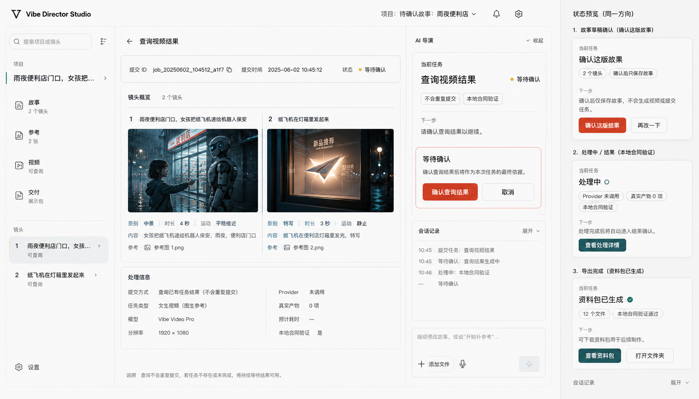
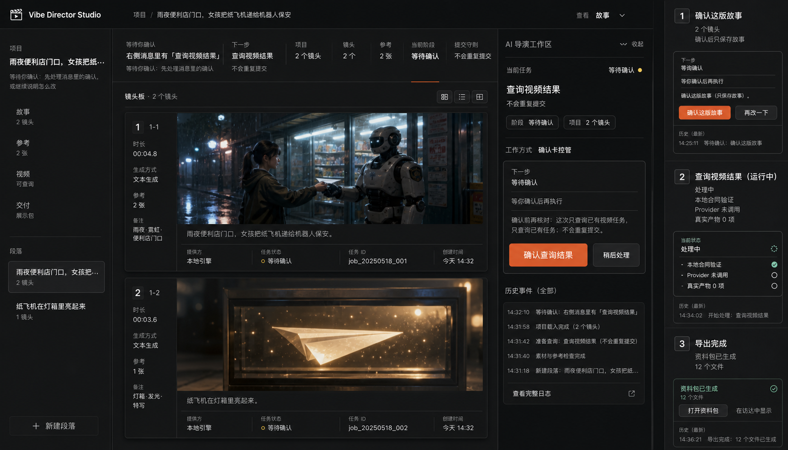
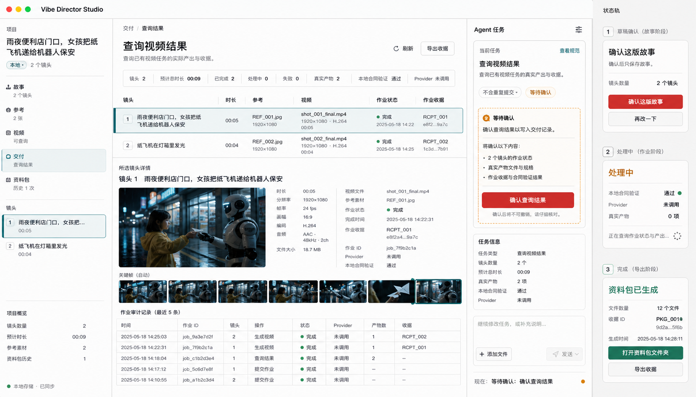

# ImageGen Direction Comparison

All three directions were generated from the same real packaged App references: draft confirmation, query-video result, and export confirmation. They are hierarchy and art-direction studies, not literal UI specifications. Generated text, IDs, thumbnails, and state details must not replace the real application contracts.

## Option 1: Signal Desk

**Character:** bright neutral production desk, graphite structure, vermilion confirmation, teal success, amber waiting.

**Strengths:**

- Preserves the familiar three-zone desktop model without making every zone equally loud.
- Gives the Agent task a clear, inspectable action surface.
- Keeps shot/media evidence visible during confirmation.
- Supports long Chinese copy and mixed light/dark media more reliably than a dark shell.
- Uses semantic accents sparingly enough to preserve trust.

**Risks:**

- Could become generic SaaS if media, shot numbering, and production metadata are simplified too far.
- The red confirmation accent must remain a deliberate action color, not a decorative brand wash.

## Option 2: Edit Bay

**Character:** dark cinematic edit bay, media-first composition, safety orange confirmation, mint success.

**Strengths:**

- Strongest cinematic identity and media prominence.
- Video and reference states feel native to a professional editing environment.
- High spatial separation between canvas and Agent task.

**Why it is not recommended:**

- Long Agent explanations and confirmation facts are harder to sustain in a dark, contrast-heavy shell.
- Bright reference images, white documents, and mixed provider assets can create glare and inconsistent visual balance.
- The direction implies an NLE timeline as the center of gravity, while the actual product centers on Agent-guided production decisions.
- It would require a broader dark-theme accessibility and asset pass than the current visual-only phase should introduce.

**What to borrow:** larger media previews, strong selected-shot treatment, and clear running-job visibility.

## Option 3: Production Ledger

**Character:** white editorial/technical ledger, dense tables, selected-shot inspector, audit-first metadata.

**Strengths:**

- Best scanability for job IDs, receipts, provider status, output files, and history.
- Makes recovery and local contract validation highly inspectable.
- Dense information can support advanced users without nested cards.

**Why it is not recommended:**

- It reads like operations or asset-administration software before it reads like a directing tool.
- Story intent, visual rhythm, and creative review become secondary to tables and audit fields.
- It over-optimizes for the query/export tail of the workflow and underweights drafting and visual iteration.
- A full ledger center would add complexity to ordinary two-shot projects.

**What to borrow:** compact job rows, receipt metadata, sortable history concepts, and the selected-shot inspector.

## Decision Matrix

Scoring: 1 is weak, 5 is strong for the current product.

| Criterion | Signal Desk | Edit Bay | Production Ledger |
| --- | ---: | ---: | ---: |
| Agent-first task clarity | 5 | 4 | 4 |
| Story and media visibility | 4 | 5 | 3 |
| Confirmation safety | 5 | 4 | 5 |
| Long-form readability | 5 | 3 | 5 |
| Job/recovery inspectability | 4 | 4 | 5 |
| Creative product character | 4 | 5 | 2 |
| Migration risk | 5 | 2 | 3 |
| Responsive feasibility | 4 | 3 | 2 |
| **Total** | **36** | **30** | **29** |

## Recommendation

Choose **Option 1: Signal Desk** for P5-B.

The implementation should be Signal Desk at the system level, Edit Bay in media emphasis, and Production Ledger in job/history detail. This combination keeps the product recognizably creative while making Agent actions and recovery facts trustworthy.

The decision is not permission to implement yet. P5-B begins only after the user explicitly confirms Signal Desk or requests a bounded revision to the direction.
